# Project UAS { Semester 3 }  

|**Nama**|**NIM**|**Kelas**|**Matkul**|
|----|---|-----|------|
|Muhammad Ikhsan Fakhrudin|312210019|TI.22.A.2|Pemrograman Mobile 1|

# Medii Apps 🐳

## User Interface

### ***Tampilan Halaman Menu  :***

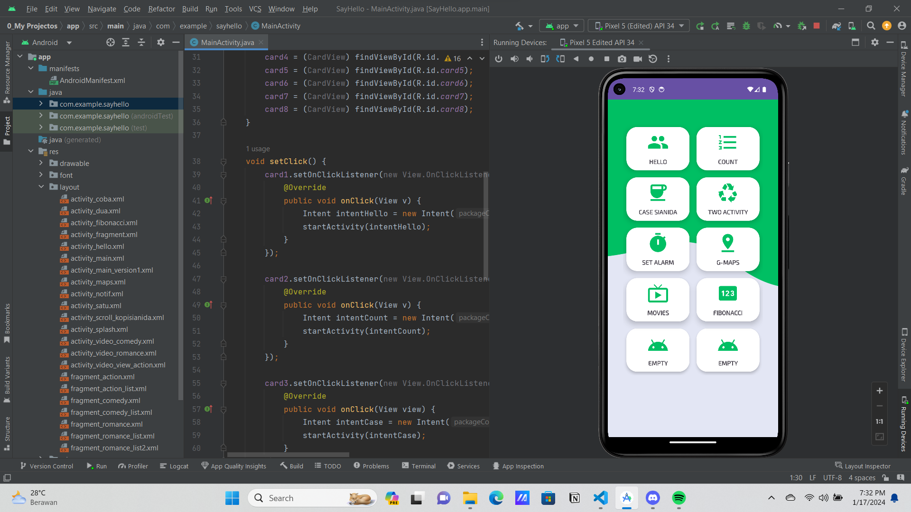

### ***Tampilan Menu Hello :***

### ***Tampilan Menu Count :***

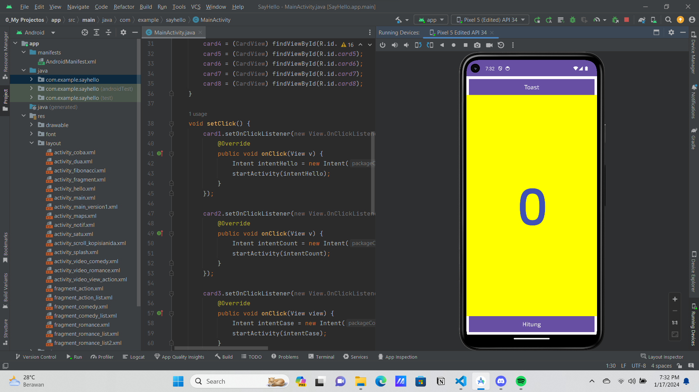

### ***Tampilan Menu Case Sianida :***

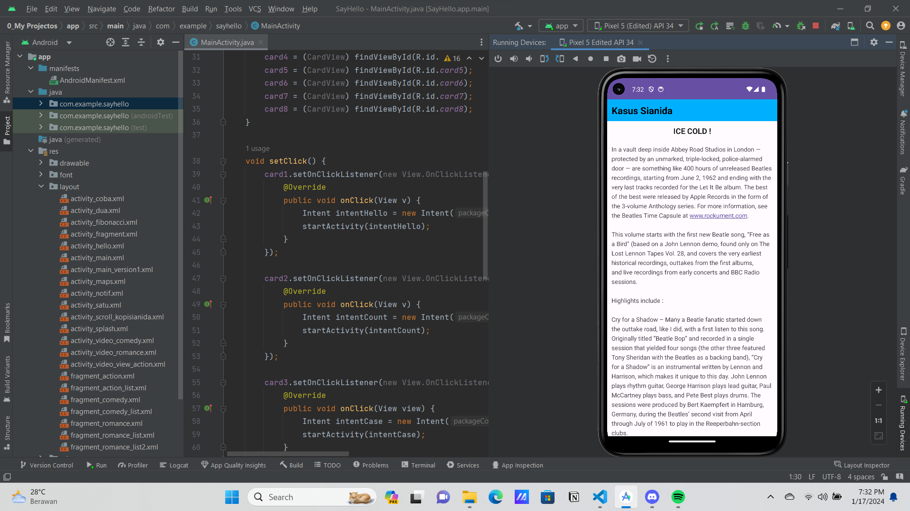

### ***Tampilan Menu Two Activity :***

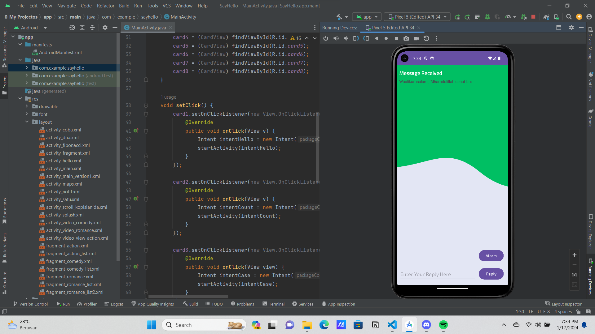

### ***Tampilan Menu Set Alarm :***

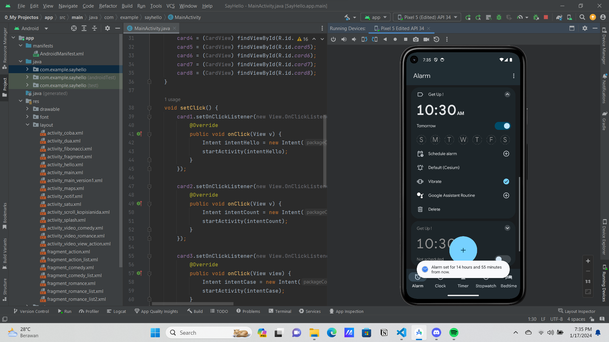

### ***Tampilan Menu Google Maps :***

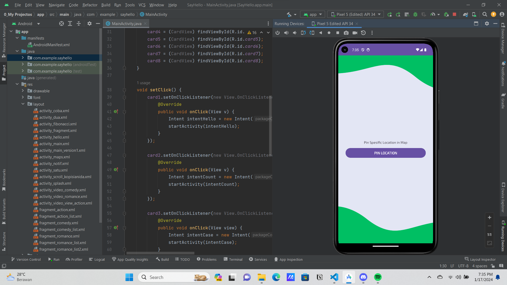

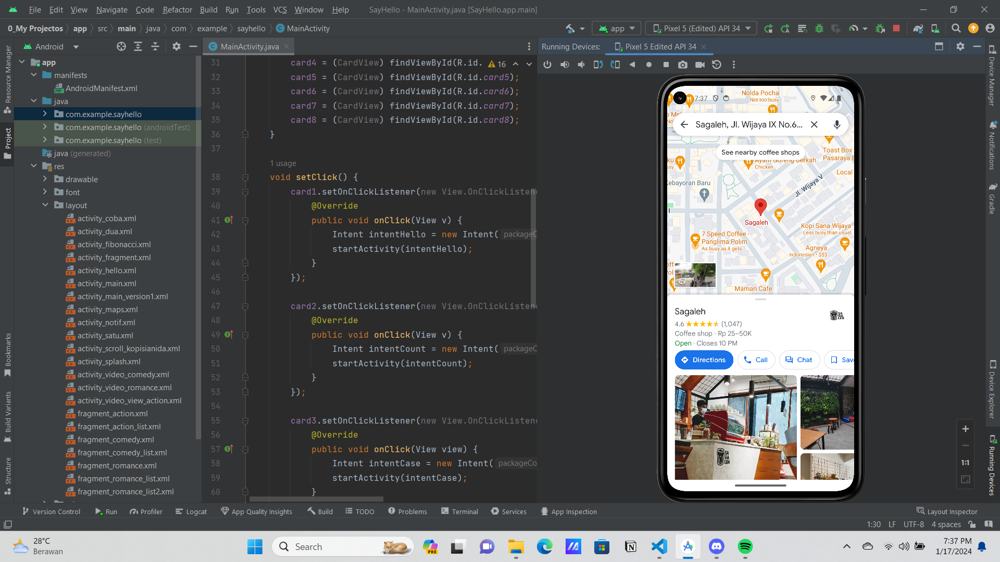

### ***Tampilan Menu Movies :***

- **Action**

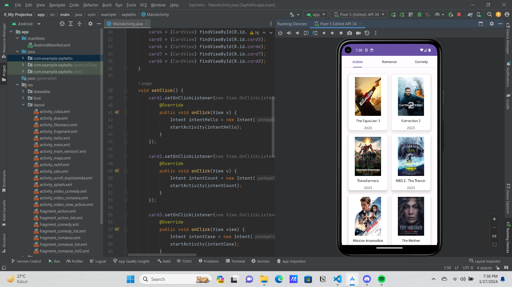

- **Romance**

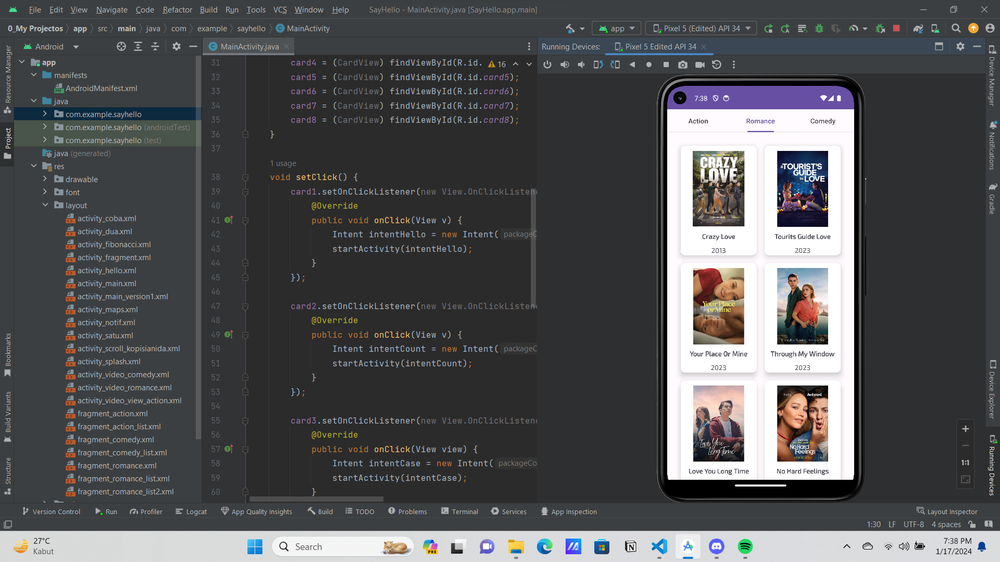

- **Comedy**

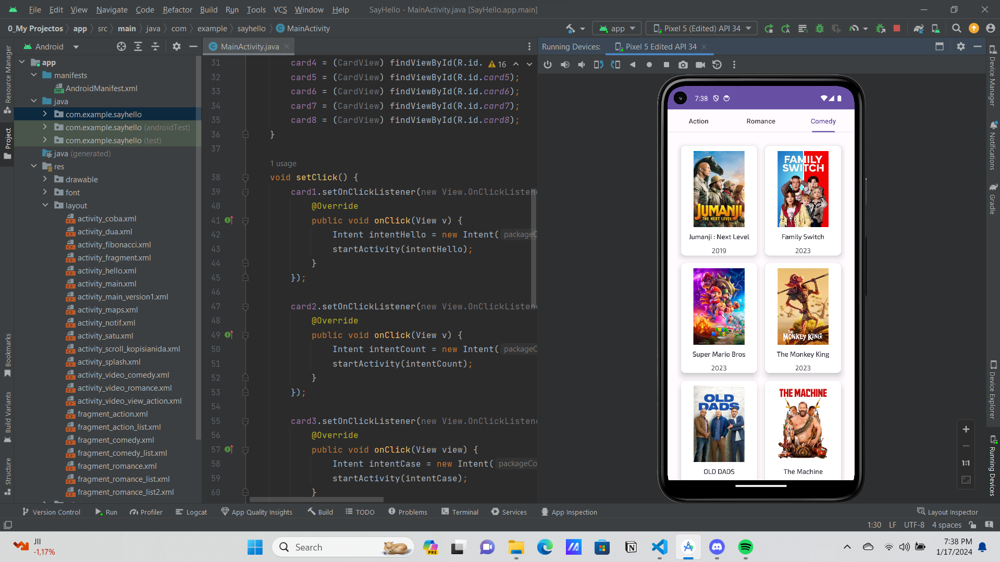

### ***Tampilan Menu Fibonacci :***

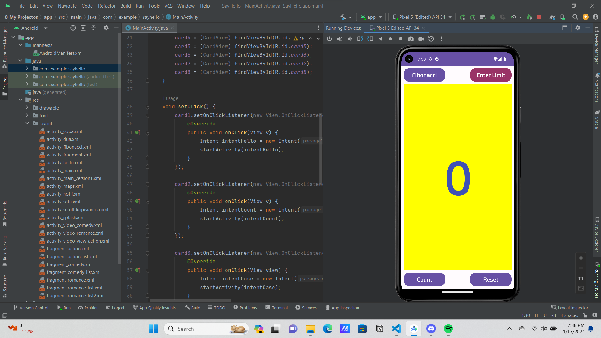

- [Link Dokumentasi YouTube](https://youtu.be/Bpwhp9YiSWI)

- [Link Penjelasan Pdf](https://bit.ly/3HaMdSp)

## SELESAI  
